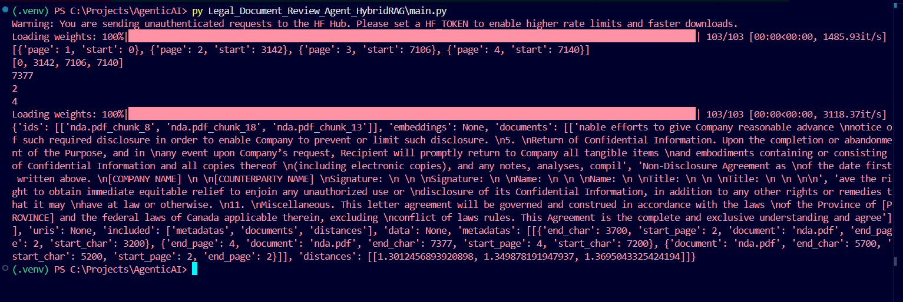

# Legal Document Review Agent

A powerful **Retrieval-Augmented Generation (RAG)** project designed to review and query legal documents intelligently. The system reads a PDF contract, splits it into meaningful chunks, generates embeddings, stores them in a vector database, and retrieves the most relevant context for answering questions about the document.



## Overview

This project demonstrates a practical hybrid RAG workflow for legal document analysis. It is especially useful for tasks such as:

- extracting key clauses from contracts
- answering questions about legal terms and obligations
- retrieving context from large documents efficiently
- building a foundation for document review assistants


## Key Features

- **PDF ingestion** using PyMuPDF
- **Text chunking** for long legal documents
- **Embedding generation** with Sentence Transformers
- **Vector storage** with ChromaDB
- **Hybrid retrieval** for relevant context
- **LLM-powered answer generation** using Semantic Kernel and Groq-style workflows

## Project Workflow

The application follows this flow:

1. Load a legal PDF document.
2. Extract text from the document.
3. Split the text into manageable chunks.
4. Generate embeddings for each chunk.
5. Store embeddings in a vector database.
6. Retrieve the most relevant chunks for a user query.
7. Build a context block and generate an answer.

```text
PDF -> Text Extraction -> Chunking -> Embeddings -> Vector DB -> Retrieval -> Answer
```

## Tech Stack

- **Python**
- **PyMuPDF** for PDF parsing
- **ChromaDB** for vector storage
- **Sentence Transformers** for embeddings
- **Semantic Kernel** for orchestration
- **OpenAI / Groq-compatible LLM flow** for response generation

## Project Structure

```text
Legal_Document_Review_Agent_HybridRAG/
├── data/
│   └── contracts/
├── src/
│   ├── chunker.py
│   ├── embeddings.py
│   ├── pdf_reader.py
│   ├── retriever.py
│   ├── vector_store.py
│   └── chat.py
├── main.py
├── requirements.txt
└── README.md
```

## Installation

1. Clone the repository.
2. Create and activate a virtual environment.
3. Install the dependencies:

```bash
pip install -r requirements.txt
```

## Usage

Run the main script:

```bash
python main.py
```

The script currently loads a sample contract from the data folder and demonstrates the end-to-end RAG pipeline.

## Example

A typical question might be:

```text
What is Confidential Information?
```

The system retrieves the most relevant chunks from the document and uses them as context to generate a response.

## Notes

This project is a strong example of how AI systems can make legal document review faster and more structured by combining retrieval, embeddings, and language models.

## Future Enhancements

Possible improvements include:

- support for multiple document formats
- better chunking strategies for legal text
- metadata-aware retrieval
- a web interface for easier interaction
- support for citations and source highlighting

