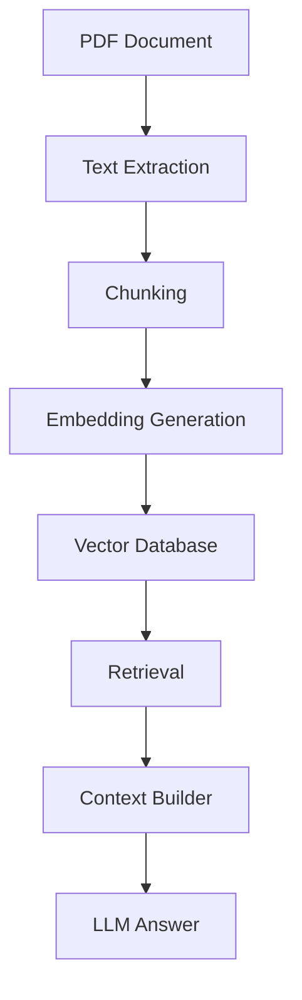

# Legal Document Review Agent Notes

This document summarizes the core ideas behind the **Legal Document Review Agent Hybrid RAG** project, with a strong focus on **embeddings**, **chunking**, **metadata**, and **domain objects**.

---

## 1. Embeddings in Practice

The following line is the core step where the model turns text chunks into vectors:

```python
embeddings = model.encode(chunks)
```

Behind the scenes, the model performs the following flow:

1. **Tokenizer**
   - splits each chunk into tokens
2. **Token IDs**
   - maps each token to numerical IDs
3. **Token Embeddings**
   - converts each token into a vector representation
4. **Transformer / Attention**
   - captures context from surrounding tokens
5. **Contextual Token Embeddings**
   - produces context-aware token vectors
6. **Mean Pooling**
   - combines token vectors into a single representation
7. **384-dimensional Sentence Embedding**
   - produces one vector for the entire chunk

```text
Chunk
→ Tokenizer
→ Token IDs
→ Token Embeddings
→ Transformer
→ Contextual Token Embeddings
→ Mean Pooling
→ 384-Dimensional Sentence Embedding
```

---

## 2. Why Chunking Matters

Chunking is the process of breaking a large document into smaller pieces before generating embeddings.

If we embed an entire 40-page legal contract as one giant vector, we lose important detail. Legal clauses such as **notice periods**, **payment terms**, and **penalties** can be diluted or missed.

- A **summary** turns text into shorter text.
- An **embedding** turns text into a point in a high-dimensional vector space.

### Golden Rule of Chunking

> A chunk should represent one complete idea.

### Good Example

> **Payment Terms**
>
> The client must pay within 30 days.
>
> If payment is delayed, a penalty of 5% will be charged.

### Bad Example

> **Payment Terms**
>
> The client must pay
>
> within 30 days.
>
> If payment is delayed...

If the user asks, *“When is payment due?”*, the retriever might find the first chunk, but the real answer is in the second chunk. This is called **context fragmentation**.

---

## 3. Chunking Trade-offs

Chunking is always a balance between precision and context.

- **Small chunks**
  - more precise retrieval
  - less surrounding context
- **Large chunks**
  - more context preserved
  - less focused embeddings

There is no single perfect chunk size. It depends on:

- document type
- embedding model
- LLM context window
- use case
- retrieval strategy

### Common Chunking Strategies

| Strategy | Quality | Speed | Production Use |
| --- | --- | --- | --- |
| Fixed size | Medium | Very fast | Sometimes |
| Sentence-based | Good | Fast | Sometimes |
| Paragraph-based | Very good | Fast | Often |
| Recursive | Excellent | Moderate | Very common |
| Semantic | Excellent | Slower | High-end systems |

For legal contracts, **recursive chunking** is often the best starting point because it preserves structure such as paragraphs, clauses, and sections.

---

## 4. Overlap

**Overlap** repeats a small portion of text between adjacent chunks so that context is not lost at chunk boundaries.

This is especially useful for legal documents because important information may span multiple sentences or paragraphs.

> Overlap preserves context across chunk boundaries and improves the chances that the retrieved context contains enough information for the model to answer accurately.

---

## 5. RAG Pipeline

The full workflow looks like this:



---

## 6. Domain Objects

A strong design principle in this project is to **enrich objects instead of creating many separate structures**.

### Page Object

This represents one page of the PDF.

```json
{
  "page": 1,
  "text": "Payment Terms..."
}
```

This object is simple and only represents one page.

### Chunk Object

This is the most important object in the pipeline.

```json
{
  "id": "nda_chunk_0",
  "document": "nda.pdf",
  "text": "Payment Terms...",
  "start_char": 0,
  "end_char": 500,
  "start_page": 1,
  "end_page": 2
}
```

This object carries the core context needed for retrieval and downstream processing.

### Embedded Chunk Object

After embedding generation, the same object becomes richer:

```json
{
  "id": "nda_chunk_0",
  "document": "nda.pdf",
  "text": "Payment Terms...",
  "start_char": 0,
  "end_char": 500,
  "start_page": 1,
  "end_page": 2,
  "embedding": [384 numbers]
}
```

This is a powerful pattern because we do not create a completely new structure; we simply **enrich the existing object**.

---

## 7. Why Use Dataclasses?

A strong interview-style answer is:

> Dataclasses provide a well-defined data model with better readability, type hints, IDE autocomplete, and fewer key-related bugs. They make the codebase easier to maintain as the project grows.

---

## 8. Why Record Page Boundaries?

If an interviewer asks this, a strong answer is:

> Because the current length of the accumulated text represents the starting index for the next page. If I record the boundary after appending, I would capture the ending position instead of the starting position.

---

## 9. Why Maintain Character Offsets or Page Boundaries?

A strong answer is:

> When the document is merged into a single text stream for chunking, page information can be lost. By recording where each page starts, we can later map a chunk back to its original page range. This enables accurate citations, debugging, and source highlighting.

---

## 10. Interview Takeaways

- For legal contracts, **recursive chunking** is usually a strong default.
- **Overlap** helps preserve context across chunk boundaries.
- **Chunk size** and **overlap** should be tuned based on the document type and retrieval quality.
- **Dataclasses** are a cleaner and safer way to represent structured objects than plain dictionaries.
- Preserving **page boundaries** and **character offsets** improves traceability and explainability.
