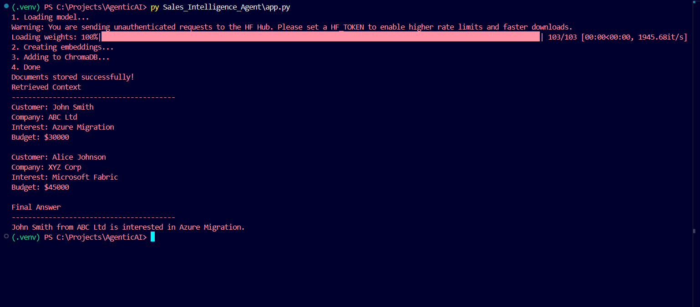

# Sales Intelligence Agent

A small prototype that ingests CRM records, creates vector embeddings using `sentence-transformers`, stores them in a local ChromaDB instance, and queries a language model via Semantic Kernel to answer sales-related questions.



**Quick overview**

- **What it does:** Converts CRM entries to embeddings, stores them in ChromaDB, retrieves the most relevant records for a user query, and asks an LLM (via Semantic Kernel) to answer using only that CRM context.
- **Main script:** [Sales_Intelligence_Agent/app.py](Sales_Intelligence_Agent/app.py)
- **Data file:** [Sales_Intelligence_Agent/data/crm_data.json](Sales_Intelligence_Agent/data/crm_data.json)

**Prerequisites**

- Python 3.10+ recommended.
- A system with pip available.
- Environment variables: `GROQ_API_KEY` and `MODEL_NAME` (set these in a `.env` file or your shell).

**Recommended Python packages**

Install the core dependencies:

```bash
pip install chromadb sentence-transformers semantic-kernel openai python-dotenv
```

(If you prefer, create a virtual environment first.)

**Setup**

1. Create and activate a virtual environment (Windows PowerShell example):

```powershell
py -m venv .venv
.\.venv\Scripts\Activate.ps1
pip install --upgrade pip
pip install chromadb sentence-transformers semantic-kernel openai python-dotenv
```

2. Create a `.env` file in the `Sales_Intelligence_Agent` directory with the following entries:

```
GROQ_API_KEY=your_groq_api_key_here
MODEL_NAME=your_model_name_here
```

3. Ensure the database folder exists (the project stores ChromaDB data at `Sales_Intelligence_Agent/chroma_db`). The code will create or use the directory automatically.

**Run the agent**

From the `Sales_Intelligence_Agent` folder run:

```powershell
py app.py
```

You should see logs for loading the embedding model, creating embeddings, upserting to ChromaDB, retrieved context, and the final LLM answer. The `Output.png` shows an example of the script's output.

**Files of interest**

- [Sales_Intelligence_Agent/app.py](Sales_Intelligence_Agent/app.py) - main script
- [Sales_Intelligence_Agent/data/crm_data.json](Sales_Intelligence_Agent/data/crm_data.json) - sample CRM records
- `Sales_Intelligence_Agent/chroma_db/` - local ChromaDB storage (created at runtime)

**Notes & Troubleshooting**

- Env vars: If `GROQ_API_KEY` or `MODEL_NAME` are not set, the Semantic Kernel/OpenAI connector will fail — confirm they are present before running.
- ChromaDB client API: Different `chromadb` versions may expose different client constructors. If you get import/constructor errors, check your installed `chromadb` version and adjust the client creation in `app.py`.
- Embeddings length mismatch: Ensure `ids`, `documents`, and `embeddings` lists have the same length before calling `collection.upsert()`.
- Semantic Kernel & OpenAI/Groq: The code uses `AsyncOpenAI` with a custom `base_url`. If the connector fails, verify compatibility and credentials.

**Contributing**

- Open an issue or submit a PR. Keep changes focused and add tests for new functionality where possible.

**License**

Specify your preferred license here.
