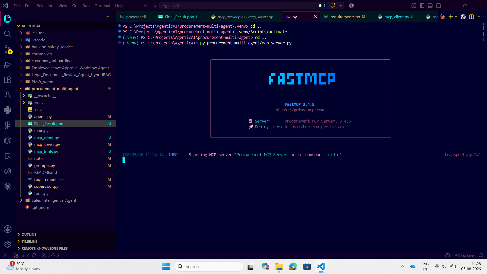
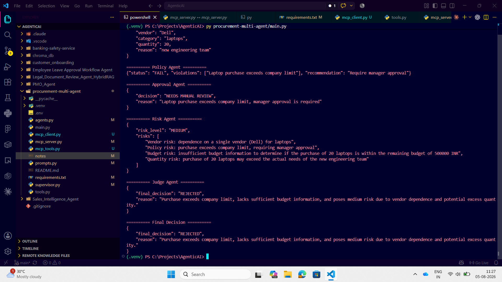

# Procurement Multi-Agent System

This project demonstrates a procurement approval workflow built with multiple AI agents and an MCP server for company policy lookup.

The flow is simple:

1. The intake agent turns a natural-language request into structured JSON.
2. The policy agent calls the MCP server to fetch company policy.
3. The approval, risk, and judge agents combine their outputs to produce the final decision.

## What It Does

- Extracts purchase details from a plain English request
- Fetches company policy from an MCP tool server
- Validates the request against policy and budget rules
- Produces a final approval decision

## Project Files

- [main.py](main.py): application entry point
- [supervisor.py](supervisor.py): orchestrates the agent workflow
- [agents.py](agents.py): agent definitions and model setup
- [mcp_server.py](mcp_server.py): MCP server that exposes company policy
- [mcp_tools.py](mcp_tools.py): helper for connecting to the MCP server
- [prompts.py](prompts.py): system prompts for each agent
- [tools.py](tools.py): local helper functions for vendor and budget data
- [requirements.txt](requirements.txt): Python dependencies
- [.env](.env): local API key and model configuration

## Screenshots

### MCP Server

This screenshot shows the MCP server running as the policy source.



### Final Result

This screenshot shows the final output produced by the agent workflow.



## Setup

1. Create and activate a virtual environment.
2. Install dependencies:

```bash
pip install -r requirements.txt
```

3. Add your API key and model name to `.env`.

## Run

```bash
py main.py
```

## Notes

- The MCP server is used only for company policy retrieval.
- The policy agent should call the tool and then reason over the returned policy data.
- The `.env` file should stay local and should not be committed to Git.
